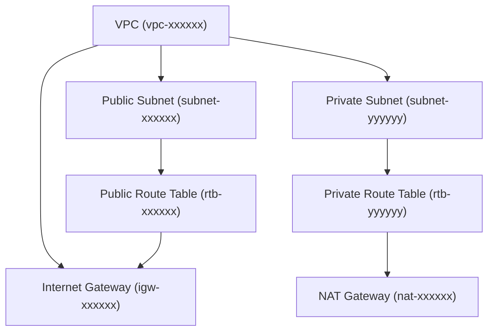

# 🛠️ VPC Setup CLI (Node.js + AWS SDK)

A modular CLI to create and manage an AWS VPC with:
- Subnets (Public + Private)
- Internet Gateway
- NAT Instance or Gateway
- Bastion Host
- Route Tables
- Auto-generated architecture diagram (Mermaid)
- Safe teardown with state tracking

---

## 🚀 Usage

```bash
npm install
npm start
```

You'll be prompted to select from the following steps:

- Create VPC
- Create Subnets
- Create Internet Gateway
- Create Bastion Host
- Create NAT Instance
- Create NAT Gateway
- Create Route Tables + NAT Association
- Create Security Groups
- Generate Architecture Diagram
- Teardown All Resources

---

## 🗂 Project Structure

```
aws-networking-setup/
├── cli.js                 # Interactive CLI menu
├── config.js              # Configuration (region, key, AMI)
├── state.js               # Persistent state manager
├── steps/                 # Each setup step as a module
│   └── 1-create-vpc.js ... 9-generate-diagram.js
├── .gitignore             # Ignores state, env, node_modules
├── vpc-state.json         # Generated state (autogenerated)
├── vpc-architecture.md    # Generated diagram in Mermaid syntax
└── README.md              # This file
```

---

## 📊 Architecture Preview (via `vpc-architecture.md`)

Run this CLI option:
```
Generate Architecture Diagram
```
And it will write to `vpc-architecture.md`:



---

## 🧹 Teardown
Use the menu option `Teardown All Resources` to delete the VPC and clear state.

> Note: You may still need to manually delete EIP, NAT gateway, or security groups if AWS doesn’t clean them up automatically.

---

## 🧰 Requirements
- Node.js 18+
- AWS credentials configured (via CLI or env)

---

## 📦 Publish This CLI
```bash
git init
git remote add origin https://github.com/YOUR_USERNAME/vpc-setup-cli.git
git add .
git commit -m "Initial commit"
git push -u origin main
```

---

MIT License © Kebede B.